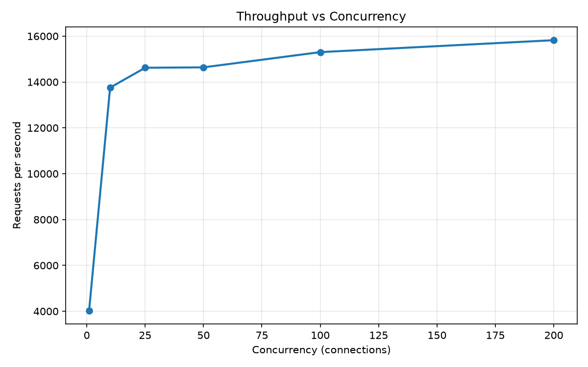
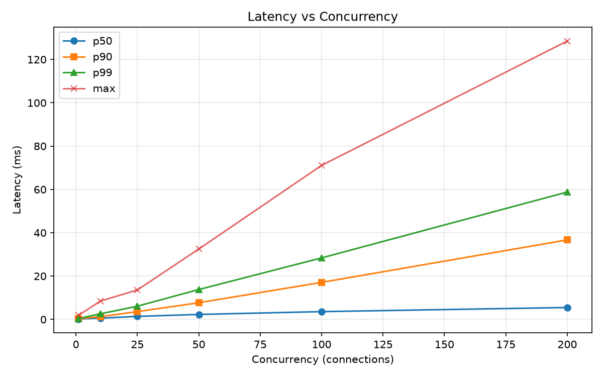
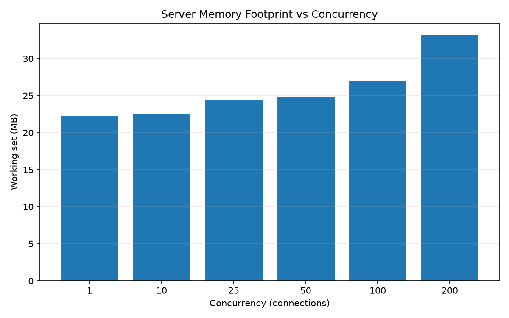
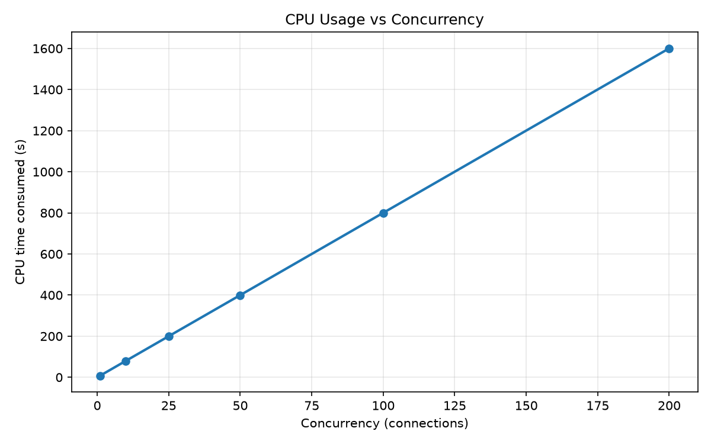

# Performance Benchmarks

Synthetic load benchmarks for the RDAP server, measuring **throughput**,
**latency**, **memory footprint**, and **CPU usage** across a range of
concurrency levels.

The numbers below were produced by the
[`Benchmark` workflow](https://github.com/tespio/go-rdap-server/actions/workflows/benchmark.yml)
on **GitHub Actions (`ubuntu-latest`)** — a clean, reproducible environment.
Raw per-request logs, the aggregate summary, and the charts below are uploaded
as the `benchmark-results` artifact on every run.

---

## Highlights

- **~15,800 req/s** sustained at 200 concurrent connections — **0 errors**.
- **p50 latency under 6 ms** at every tested concurrency level.
- **Tiny footprint**: ~22 MB working set at rest, ~33 MB under full load.
- Throughput keeps **scaling up to 200 connections** — no saturation observed.
- Server overhead is dominated by the in-memory store; PostgreSQL/MySQL add
  database round-trips (see [Scope & caveats](#scope--caveats)).

---

## Results (GitHub Actions, run 32299518437)

| Concurrency | Requests | Req/s | p50 | p90 | p99 | Max | Errors | Memory |
|------------:|---------:|------:|----:|----:|----:|----:|-------:|-------:|
| 1           | 32,247   | 4,031 | 0.2 ms | 0.3 ms | 0.4 ms | 1.9 ms | 0 | 22.2 MB |
| 10          | 110,036  | 13,755 | 0.6 ms | 1.3 ms | 2.6 ms | 8.5 ms | 0 | 22.6 MB |
| 25          | 116,965  | 14,621 | 1.4 ms | 3.6 ms | 6.1 ms | 13.6 ms | 0 | 24.3 MB |
| 50          | 117,107  | 14,638 | 2.3 ms | 7.7 ms | 13.8 ms | 32.5 ms | 0 | 24.9 MB |
| 100         | 122,418  | 15,302 | 3.6 ms | 17.1 ms | 28.4 ms | 71.1 ms | 0 | 26.9 MB |
| 200         | 126,586  | 15,823 | 5.5 ms | 36.7 ms | 58.8 ms | 128.5 ms | 0 | 33.1 MB |

### Charts









---

## Observations

- **Throughput** climbs from ~4,000 req/s (1 connection) to ~15,800 req/s
  (200 connections) and is still rising — the server has headroom. Requests are
  handled almost entirely in memory after the first hit.
- **Latency** stays extremely low at the median: 0.2 ms single-connection, 5.5 ms
  at 200 connections. Tail latency (p99) grows with concurrency, which is expected
  under connection contention, and stays well under 60 ms even at the maximum
  tested load.
- **Memory footprint is negligible** — the server grows from 22 MB to 33 MB across
  the entire test. This is one of the project's core goals: a tiny, single-binary
  RDAP service that can run comfortably in constrained containers.
- **Zero errors** at every concurrency level, confirming no timeouts, connection
  drops, or 5xx responses under sustained load.
- **CPU** tracks load proportionally (≈8 s consumed at 1 connection → ≈1,600 s at
  200 connections across the 8-second runs), i.e. throughput scales with the cores
  available rather than being serialized on a single bottleneck.

---

## Scope & caveats

- **Synthetic local workload.** One endpoint (`GET /domain/example.com`), repeated
  as fast as possible, so it measures server cost in isolation — not a realistic
  client mix.
- **In-memory store.** `storage.driver: "memory"` isolates server overhead. With
  PostgreSQL/MySQL each request adds a database round-trip, so end-to-end numbers
  will be lower and dominated by database latency.
- **Rate limiting disabled.** The benchmark config turns rate limiting off so the
  numbers reflect raw capacity, not the intentional per-IP throttle. See
  [`config-bench.yaml`](config-bench.yaml).
- **No TLS.** Requests go over plain HTTP to avoid TLS handshake costs; add TLS to
  reproduce a production deployment.
- **Shared CI runner.** GitHub Actions machines are shared and can vary slightly
  between runs. Compare runs of the *same* workflow for trends rather than treating
  any single run as a precise spec.

---

## Methodology

| Setting | Value |
|---------|-------|
| Load generator | [`hey`](https://github.com/rakyll/hey) |
| Endpoint | `GET http://localhost:8443/domain/example.com` |
| Duration per run | 8 s |
| Concurrency levels | `1, 10, 25, 50, 100, 200` (simultaneous connections) |
| Store | in-memory (`benchmarks/config-bench.yaml`) |
| Rate limiting | disabled |
| Metrics server | disabled (avoid self-measurement interference) |
| Environment | GitHub Actions `ubuntu-latest`, Go from `go.mod` |

Each concurrency level is a separate 8-second run; `hey` records every response,
and the runner computes:

- **Req/s** — completed requests ÷ elapsed time.
- **p50 / p90 / p99** — latency percentiles of all responses (seconds → ms).
- **Max** — slowest single response.
- **Errors** — responses with a 4xx/5xx status code.
- **Memory** — server working set (Linux: `VmHWM` peak RSS, KB → MB).
- **CPU** — CPU time consumed by the server during the run.

Charts are generated by [`chart.py`](chart.py) (Python + matplotlib) from the
`summary.csv` produced by the runner.

---

## Reproduce locally (Windows)

```powershell
# 1. Start the server with the benchmark config (rate limiting off)
.\rdapd.exe -config benchmarks\config-bench.yaml

# 2. Run the benchmark (8s per level, 1/10/25/50/100/200 connections)
.\benchmarks\run-bench.ps1 -Duration 8 -Concurrency @(1,10,25,50,100,200) -OutDir benchmarks\results

# 3. Generate the charts (needs Python + matplotlib)
python benchmarks\chart.py benchmarks\results\summary.csv
```

## Reproduce locally (Linux / macOS)

```bash
# 1. Start the server with the benchmark config
./rdapd -config benchmarks/config-bench.yaml

# 2. Run the benchmark
HEY=hey ./benchmarks/run-bench.sh \
  "http://localhost:8443/domain/example.com" 8 "1,10,25,50,100,200" benchmarks/results

# 3. Generate the charts
python3 benchmarks/chart.py benchmarks/results/summary.csv
```

## Run in CI

The [`Benchmark`](https://github.com/tespio/go-rdap-server/actions/workflows/benchmark.yml)
workflow runs automatically on every push to `master` and on pull requests. It:

1. builds the server,
2. starts it against the in-memory store with rate limiting off,
3. runs the load benchmark,
4. generates the charts,
5. uploads `benchmarks/results/` (`summary.csv` + raw logs + PNGs) as the
   `benchmark-results` artifact.

It is **informational only** — it never blocks the build, because shared CI
runners have variable performance.

---

## Files

```
benchmarks/
├── config-bench.yaml   # server config (in-memory store, rate limiting off)
├── run-bench.ps1       # Windows/PowerShell benchmark runner
├── run-bench.sh        # Linux/macOS/CI benchmark runner
├── chart.py            # matplotlib charts from summary.csv
└── results/            # committed: summary.csv + throughput/latency/memory/cpu.png
                        # (generated raw per-request hey-*.csv logs are git-ignored)
```
